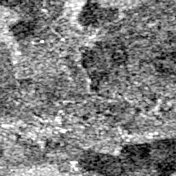
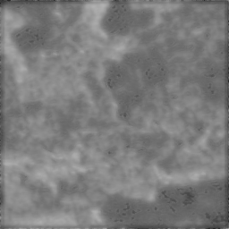

# Despeckling SAR images

This repository contains an algorithm that removes speckle noise from SAR images using convolutional neural networks, implemented with PyTorch framework. The implementation is based on the network from [Kaggle](https://www.kaggle.com/code/javidtheimmortal/sar-image-despeckling-using-a-convolutional-neural/notebook).

## Dataset

The dataset should contain clean images (without noise) and noisy images. The required file structure is:

```
dataset/
├── test
│   ├── clean
│   └── noise
├── train
│   ├── clean
│   └── noise
└── val
    ├── clean
    └── noise
```

Prepared dataset for training and testing:  
[Yandex Disk link](https://disk.yandex.ru/d/SH8-sVZkq6z23w)  
Full dataset available on [Kaggle](https://www.kaggle.com/code/javidtheimmortal/sar-image-despeckling-using-a-convolutional-neural/data)

## Usage

### Training
```sh
. ./scripts/train.sh
```

### Testing
```sh
. ./scripts/test.sh
```

### Inference
```sh
. ./scripts/inference.sh
```

### Code quality check
```sh
. ./scripts/code-quality-check.sh
```

## Results

Testing results for different architectures:

| Model                        | RSNR (dB) | SSIM |
|------------------------------|-----------|------|
| DespeckleNet                 | 18.18     | 0.51 |
| DespeckleNet++               | 17.03     | 0.42 |
| CBAMDilated                  | 17.63     | 0.40 |
| MultiScaleReconstructionNet  | 17.25     | 0.43 |

Model checkpoints: [Yandex Disk link](https://disk.yandex.ru/d/uwuDbAnWvx1NcA)

## Examples

| Before denoising | After denoising |
|------------------|-----------------|
|  |  |
